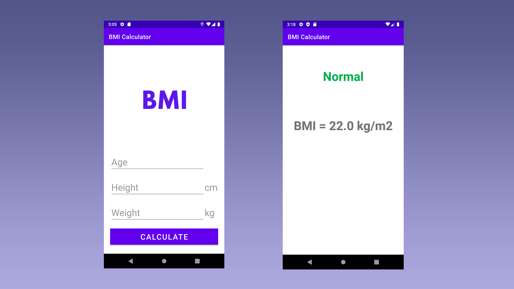

<h1 align="center">BMI Calculator</h1>
<div align="center">
  <a href="https://github.com/DmetroSK/BMI-Calculator/stargazers"></a>
<a href="https://github.com/DmetroSK/BMI-Calculator/network/members"></a>
<a href="https://github.com/DmetroSK/BMI-Calculator/pulls"></a>
<a href="https://github.com/DmetroSK/BMI-Calculator/issues"></a>
<a href="https://github.com/DmetroSK/BMI-Calculator/graphs/contributors"></a>
<a href="https://github.com/DmetroSK/BMI-Calculator/blob/main/LICENSE"></a>
</div>
<br>

<details open="open">
  <summary>Table of Contents</summary>
  <ol>
    <li><a href="#about-the-project">About The Project</a></li>
    <li><a href="#built-with">Built With</a></li>
    <li><a href="#interface">Interface</a></li>
    <li><a href="#getting-started">Getting Started</a></li>
    <li><a href="#contributing">Contributing</a></li>
    <li><a href="#license">License</a></li>
    <li><a href="#support">Support</a></li>
     </ol>
</details>

## About The Project

This BMI Calculator app makes it easy to check your health status. Just enter your age, height (in cm), and weight (in kg), then press the Calculate button. The app will show your BMI value and display your health category such as Underweight, Normal, Overweight, or Obese. A simple way to stay informed about your body and health.

## Built With

```sh
Android - Java
```

## Interface



## Getting Started

Download this apk file to your android device.

```sh
App Name -  BMI.apk
```

[Download](https://github.com/DmetroSK/BMI-Calculator/raw/main/BMI.apk)

## Contributing

Contributions are what make the open source community such an amazing place to be learn, inspire, and create. Any contributions you make are **greatly appreciated**.

1. Fork the Project
2. Create your Feature Branch (`git checkout -b feature/AmazingFeature`)
3. Commit your Changes (`git commit -m 'Add some AmazingFeature'`)
4. Push to the Branch (`git push origin feature/AmazingFeature`)
5. Open a Pull Request

## License

Distributed under the MIT License. See `LICENSE` for more information.

## Support

Give a ⭐️ if this project helped you!
